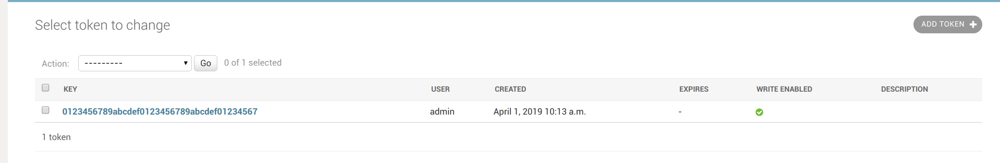

# netbox-rancid
Sync devices from Netbox to rancid

# Netbox

## Create token

Create a new token:

## Create new key

we need a private an public key for en encrypt and decrypt passwords:

## Custom field Rancid

# Rancid

We need create the .cloginrc and routerdb:

https://github.com/danielcastropalomares/ansible-container-rancid

Install the python script inside of the machine rancid:

/var/lib/rancid/netbox-sync.py
